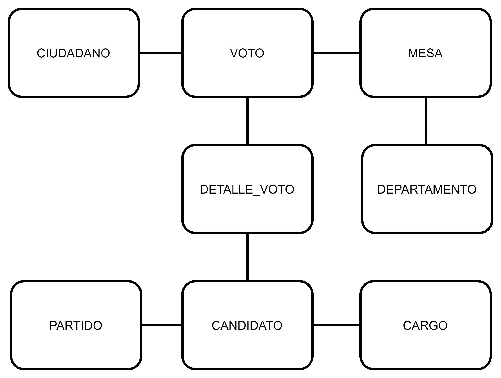
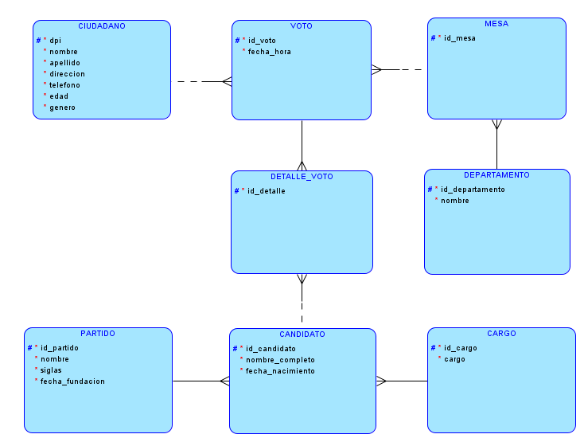
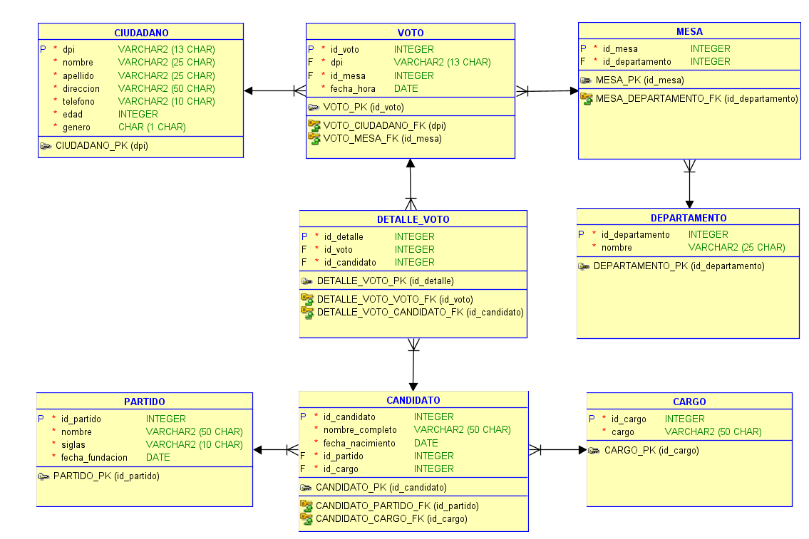

# **MANUAL TÉCNICO**  
#### UNIVERSIDAD DE SAN CARLOS DE GUATEMALA
#### FACULTAD DE INGENIERÍA
#### ESCUELA DE CIENCIAS Y SISTEMAS
#### SISTEMA DE BASES DE DATOS 1
---
#### PROYECTO 1
#### ANGEL MIGUEL GARCÍA URIZAR
#### 201901421
---
### **DESCRIPCIÓN GENERAL DEL PROBLEMA**  

El Tribunal Supremo Electoral (TSE) tiene la responsabilidad crucial de recopilar los resultados de las elecciones de diversas mesas distribuidas en todo el territorio nacional. En este contexto, se busca implementar un sistema de bases de datos capaz de realizar consultas que permitan verificar la coherencia entre los reportes manuales y los generados por el sistema de bases de datos. El objetivo primordial es establecer un proceso transparente y confiable que garantice la integridad y precisión de los resultados electorales. 

---
### **AMBIENTE DE DESARROLLO**

* Javascript
* Node js
* Express
* MYSQL  
  
---  
### **API**  
* Se utilizó Node js y Express para el desarrollo de la API REST.
  
* La API corre en el puerto 3000.

|Endpoint| Tipo| Descripción |
|:--:|:--:|:--|
|/|GET|Mensaje inicial al consumir la API|
|/crearmodelo|GET|Crea las tablas del modelo de la base de datos|
|/cargartabtemp|GET|Se encarga de la carga de datos a la base. Lee los datos de los archivos CSV y los carga a tablas temporales de las cuales se hace la carga hacia las tablas del modelo|
|/eliminarmodelo|GET|Elimina las tablas del modelo de la base de datos.|
|/consulta1|GET|Muestra para cada partido el nombre de su binomio presidencial|
|/consulta2|GET|Cuenta la cantidad de candidatos a diputado por partido|
|/consulta3|GET|Para cada partido muestra su candidato a alcade|
|/consulta4|GET|Obtiene la cantidad total de candidatos por partido|
|/consulta5|GET|Número de votos por departamento|
|/consulta6|GET|Cantidad de votos nulos|
|/consulta7|GET|Obtiene las 10 edades que más votaron|
|/consulta8|GET|Obtiene los 10 binomios presidenciales más votados|
|/consulta9|GET|Muestra las 5 mesas donde más votos se registrarón|
|/consulta10|GET|Obtiene las 5 horas de votación más concurridas|
|/consulta11|GET|Cantidad de votos por género|  

---  

### **CONSULTAS SQL**  
* Todas las sentencias DDL y DML están el archivo database.sql

* Las consultas no son leídas directamente por la API desde ese archivo, este únicamente es el script SQL.  
  
---  
### **MODELO DE BASE DE DATOS** ###  
  

Conceptual
  

  

  
  

Lógico
  

  

  
  

Físico (ER)
  

  

  

---  

#### **SOBRE EL MODELO FÍSICO** ####  

 Entidades 
  

  * CIUDADANO  
    |Atributo|Nombre|Tipo|PK|FK|AI|
    |:--:|:--:|:--:|:--:|:--:|:--:|
    |1|dpi|VARCHAR(13)|X| | |
    |2|nombre|VARCHAR(25)| | | |
    |3|apellido|VARCHAR(25)| | | |
    |4|direccion|VARCHAR(50)| | | |
    |5|telefono|VARCHAR(10)| | | |
    |6|edad|INT| | | |
    |7|genero|CHAR(1)| | | |
  * VOTO  
    |Atributo|Nombre|Tipo|PK|FK|AI|
    |:--:|:--:|:--:|:--:|:--:|:--:|
    |1|id_voto|INT|X||X|
    |2|dpi|VARCHAR(13)| |X| |
    |3|id_mesa|INT||X| |
    |4|fecha_hora|DATETIME| | | |
  * DETALLE_VOTO  
    |Atributo|Nombre|Tipo|PK|FK|AI|
    |:--:|:--:|:--:|:--:|:--:|:--:|
    |1|id_detalle|INT|X| |X|
    |2|id_voto|INT| |X| |
    |3|id_candidato|INT| |X| |
  * MESA  
    |Atributo|Nombre|Tipo|PK|FK|AI|
    |:--:|:--:|:--:|:--:|:--:|:--:|
    |1|id_mesa|INT|X| |X|
    |2|id_departamento|INT| |X| |
  * DEPARTAMENTO  
    |Atributo|Nombre|Tipo|PK|FK|AI|
    |:--:|:--:|:--:|:--:|:--:|:--:|
    |1|id_departamento|INT|X| |X|
    |2|nombre|VARCHAR(25)| | | |
  * CARGO  
    |Atributo|Nombre|Tipo|PK|FK|AI|
    |:--:|:--:|:--:|:--:|:--:|:--:|
    |1|id_cargo|INT|X| | |
    |2|cargo|VARCHAR(50)| | | |
  * PARTIDO  
    |Atributo|Nombre|Tipo|PK|FK|AI|
    |:--:|:--:|:--:|:--:|:--:|:--:|
    |1|id_partido|INT|X| | |
    |2|nombre|VARCHAR(50)| | | |
    |2|siglas|VARCHAR(10)| | | |
    |3|fecha_fundacion|DATE| | | |
  * CANDIDATO  
    |Atributo|Nombre|Tipo|PK|FK|AI|
    |:--:|:--:|:--:|:--:|:--:|:--:|
    |1|id_candidato|INT|X| | |
    |2|nombre_completo|VARCHAR(50)| | | |
    |3|fecha_nacimiento|DATE| | | |
    |4|id_partido|INT| |X| |
    |5|id_cargo|INT| |X| |  

  
  

 Relaciones 
  

* Un ciudadano puede emitir uno o muchos votos    
  Cada voto debe ser emitido por uno y solamente un ciudadano  

* Un voto debe registrar uno o más detalles de votación   
  Cada detalle de votación debe estar asociado a un voto  

* Cada voto debe ser emitido en una mesa  
  Una mesa puede registrar uno o muchos votos  

* Cada mesa debe pertenecer a uno y solamente un departamento   
  Cada departamento debe poseer una o muchas mesas  

* Cada detalle de votación debe asociar un candidato    
  Un candidato puede asociarse con uno o muchos detalles de voto  

* Cada candidato debe de postularse a un cargo  
  Cada cargo debe tener uno o muchos candidatos  

* Cada candidato debe de pertenecer a uno y solamente un partido  
  Un partido debe tener uno o más candidatos postulados

   

 Tabla DETALLE_VOTO 
   
La tabla DETALLE_VOTO aparece como parte de aplicar la primera forma de normalización (1FN), esta normalización indica que cada atributo debe contener un valor indivisible y que un registro no debe tener valores repetidos para la misma llave primaria.

